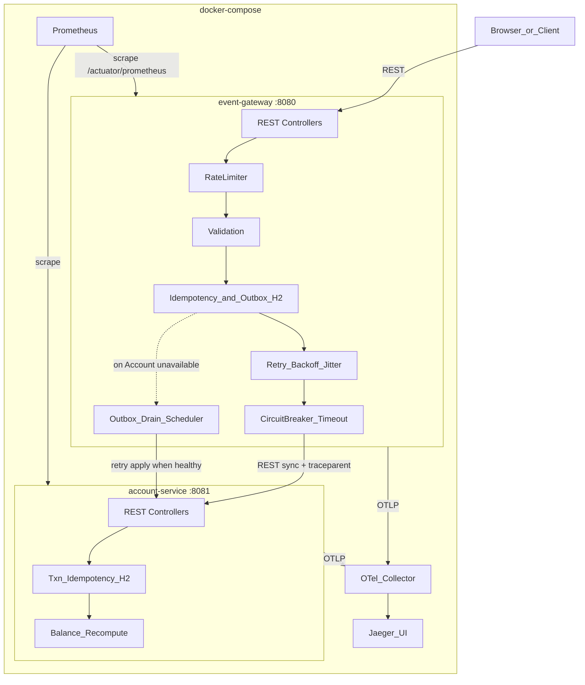

# Event Ledger — Architecture Specs & Implementation Plan

## Verdict on Kafka (read first)

**Do not create or run a Kafka broker for this assignment.**

| Signal | What it says |
|--------|----------------|
| Assignment architecture diagram | Gateway → Account via **REST (sync)** only |
| Constraints section | **"Communication: Synchronous REST calls between services"** |
| Required resiliency | Circuit breaker / bulkhead / timeout+retry on **HTTP** calls |
| Graceful degradation | GETs still work from Gateway local DB when Account is down |
| Bonus async fallback | "queue events **locally** when Account Service is down" — local queue in Gateway H2, not Kafka |
| JD | Kafka is a **nice-to-have**, not required for scoring this exercise |

**Walkthrough line:** Core path stays sync REST. Bonus async fallback uses a **Gateway-local outbox table** (H2). Production evolution would swap that outbox publisher to Kafka — documented in SPECS/README, not built here.

---

## Why this tech stack (aligned to JD + resume + constraints)

| Choice | Decision | Why |
|--------|----------|-----|
| Language | **Java 21** | JD #1 must-have |
| Framework | **Spring Boot 3.4+** | JD Spring; your production stack |
| Build | **Maven** multi-module | Enterprise-standard; `mvn test` |
| Inter-service (happy path) | **Synchronous REST** (`RestClient`) | Hard constraint |
| Async fallback (bonus) | **Gateway-local H2 outbox + scheduled drain** | Matches bonus wording; no broker |
| DBs | **H2 in-memory** per service | Required isolation |
| Idempotency | Unique `event_id` in both services | Safe retries / drain |
| Resiliency | **Resilience4j CB + TimeLimiter + Retry** | Required CB story + bonus retry/jitter |
| Rate limit (bonus) | **Resilience4j RateLimiter** on `POST /events` | Same library family |
| Tracing (bonus) | **Micrometer Tracing → OTel → Collector → Jaeger** | Assignment bonus stack |
| Metrics (bonus) | **Micrometer Prometheus** `/actuator/prometheus` | Assignment bonus |
| Contracts (bonus) | **Pact JVM** consumer + provider | Assignment bonus |
| Containers | **Docker Compose** | gateway, account, otel-collector, jaeger, prometheus |
| Tests | **JUnit 5, MockMvc, WireMock, Pact, AssertJ** | Required + bonus coverage |

**Rejected alternatives:**

- Python/C#: weaker JD match
- Kafka/RabbitMQ as runtime dependency: violates sync REST + overbuilds the local-queue bonus
- Shared Postgres/Redis: violates per-service embedded DB
- WebFlux-only: harder walkthrough for little gain
- Bucket4j for rate limit: Resilience4j keeps one resiliency story

---

## Target architecture (required + all bonuses)



**No Kafka broker. No shared DB. No shared JVM heap.**

---

## Deliverable 1: Create `SPECS.md` (first artifact)

After approval, write [`SPECS.md`](SPECS.md) covering:

1. Problem summary and non-goals (Kafka broker out)
2. Locked tech stack + trade-offs
3. Service API contracts and status codes (incl. 202 for queued, 429 for rate limit)
4. Data models (Gateway Event + outbox status, Account Transaction)
5. Core algorithms + write path with async fallback branch
6. Resiliency stack: CB + timeout + retry/jitter + rate limit
7. Observability: logs, OTel→Collector→Jaeger, Prometheus metrics
8. Pact contract boundaries
9. Repo layout, commit strategy, full test matrix (required + all bonuses)
10. Interview talking points

---

## Critical design decisions

### A. Write path (sync success + bonus async fallback)

```text
1. RateLimiter acquire (else 429)
2. Validate payload (else 400)
3. If eventId exists in Gateway:
     - APPLIED / duplicate → 200 + original body (never re-call Account)
     - PENDING → 200/202 + current body (idempotent re-submit while queued)
4. Try Account apply via Retry → CircuitBreaker → Timeout:
     a. Success → persist Gateway event status=APPLIED → 201
     b. Account 4xx → map 4xx, do not persist
     c. Account unavailable / timeout / CB open:
          - Persist event status=PENDING in local outbox → 202 Accepted
          - Response body includes status PENDING and reason
5. Outbox drain scheduler (e.g. every 2s):
     - Skip if CB open
     - For each PENDING (oldest first): call Account (idempotent)
     - On success → mark APPLIED
     - On failure → leave PENDING; increment attempt; backoff per-row optional
```

**Required graceful-degradation nuance:** Problem statement says POST returns 503 when Account is down. With the async-fallback bonus enabled (default **on** for this submission), we **elevate** that to **202 + local queue**, which is strictly better UX and is explicitly invited by the bonus. Document in README:

- GETs always work from Gateway local data (required)
- POST never hangs; returns 202 when queued, never a bare 500
- Feature flag `gateway.async-fallback.enabled=false` restores strict 503 fail-fast for demo comparison

### B. Out-of-order balances

Never `balance += delta` by arrival order. Account stores every txn; balance = `SUM(CREDIT) − SUM(DEBIT)`. Gateway lists by `eventTimestamp ASC`, `eventId` tie-break.

### C. HTTP status contract

| Case | Status |
|------|--------|
| New event applied immediately | `201 Created` |
| Duplicate applied eventId | `200 OK` + original |
| Queued via async fallback | `202 Accepted` (status=PENDING) |
| Rate limited | `429 Too Many Requests` |
| Validation failure | `400` |
| Async fallback disabled + Account down | `503` |
| Event not found | `404` |

### D. Resiliency stack (required + bonus retry)

Order of decoration on Account client:

1. **Retry** (Resilience4j): max 3 attempts, exponential backoff + **jitter**, retry only on IO/5xx/timeout — **not** on 4xx; respect CB (no retry storm when open)
2. **TimeLimiter / RestClient timeout**: ~2s per attempt
3. **CircuitBreaker**: failureRateThreshold 50%, slidingWindow 10, waitDurationInOpenState 10s → fail fast into async fallback / 503

**Why CB + Retry together:** Retry absorbs blips; CB stops hammering a dead dependency. Bonus asks for backoff+jitter explicitly — implement it, and explain interaction in README.

**Bulkhead:** Not primary; note as alternative in README (thread isolation).

### E. Rate limiting (bonus)

- Resilience4j `RateLimiter` on Gateway `POST /events` only (reads unrestricted for demo simplicity)
- Config e.g. 20 requests / 1s refresh; return **429** with clear JSON error
- Test: burst over limit → 429; under limit → success

### F. Observability (required + Jaeger/Prometheus bonuses)

- JSON logs: `timestamp`, `level`, `service`, `traceId`, `spanId`, `message`
- W3C `traceparent` Gateway → Account
- Both services export OTLP → **OpenTelemetry Collector** → **Jaeger**
- Actuator: `/health`, `/actuator/prometheus`
- Custom metrics examples:
  - `events_submitted_total{result="created|duplicate|rejected|queued|rate_limited"}`
  - `account_service_call_duration_seconds`
  - `outbox_pending_events` (gauge)
  - `outbox_drain_success_total`

Docker Compose services: `otel-collector`, `jaeger`, `prometheus` (+ both apps). README links Jaeger UI and Prometheus targets.

### G. Contract tests — Pact (bonus)

- **Consumer:** `event-gateway` Pact tests define expected Account `POST /accounts/{id}/transactions` and balance/detail shapes
- **Provider:** `account-service` verifies against Pact broker-less local pact files (`pacts/` in repo)
- Run via `mvn test` (or dedicated module profile); commit generated pacts

### H. Bonus scope — all six included

| Bonus from problem statement | Plan decision |
|------------------------------|---------------|
| OpenTelemetry Collector + Jaeger or Zipkin | **OTel Collector + Jaeger** in Compose |
| Prometheus metrics endpoint | **`/actuator/prometheus`** on both services |
| Retry with exponential backoff + jitter | **Resilience4j Retry** on Account client |
| Rate limiting on the Gateway | **Resilience4j RateLimiter** on `POST /events` |
| Contract tests (Pact or similar) | **Pact JVM** consumer + provider |
| Async fallback: queue locally, process on recovery | **H2 outbox + scheduler**; **202 Accepted**; no Kafka |

**Still explicitly out:** Kafka/RabbitMQ brokers as runtime components (document as production evolution of the outbox).

---

## Proposed repo structure

```text
event-ledger/
  SPECS.md
  README.md
  docker-compose.yml
  otel-collector-config.yaml
  prometheus.yml
  pacts/                            # checked-in or generated Pact files
  pom.xml
  event-gateway/
  account-service/
```

Compose profile/services: `account-service`, `event-gateway`, `otel-collector`, `jaeger`, `prometheus`.

---

## Implementation sequence (meaningful commits)

1. **docs:** `SPECS.md` (stack, Kafka non-goal, all bonuses locked)
2. **chore:** Maven multi-module + Dockerfiles
3. **feat(account):** Domain, H2, APIs, unit tests
4. **feat(gateway):** Validation, H2 events, GET APIs, unit tests
5. **feat(gateway):** Account RestClient + sync write path
6. **feat:** CircuitBreaker + Timeout + Retry (backoff+jitter) + WireMock tests
7. **feat:** RateLimiter on POST + 429 tests
8. **feat:** Async outbox fallback + drain scheduler + tests
9. **feat:** JSON logging + OTel export; Compose Collector + Jaeger
10. **feat:** Prometheus endpoint + custom metrics; Compose Prometheus
11. **test:** Pact consumer + provider verification
12. **test:** Full integration / degradation / trace / outbox E2E
13. **docs:** README (setup, tests, resiliency choice, bonus tour, Kafka evolution note)

---

## Test matrix (`mvn test`)

| Requirement / bonus | How verified |
|---------------------|--------------|
| Idempotency | Double POST → 200; balance unchanged |
| Out-of-order | Timestamp order in list; correct balance |
| Balance formula | Multi CREDIT/DEBIT |
| Validation | 400 cases |
| Circuit breaker | WireMock failures → open → fail-fast |
| Retry + jitter | WireMock flaky 500 then 200 → success within max attempts; verify attempt count |
| Rate limit | Burst → 429 |
| Async fallback | Account down → 202 PENDING; bring Account up → drain → APPLIED + balance correct |
| Strict degradation flag | `async-fallback=false` + Account down → 503; GETs still 200 |
| Trace propagation | Same traceId Gateway→Account; visible in test MDC/header assert |
| Prometheus | `/actuator/prometheus` contains custom series |
| Pact | Consumer publishes; provider verifies |
| Integration | Full Gateway → Account happy path |

---

## Interview talking points

1. **Java/Spring:** Matches Schwab must-have stack.
2. **Why no Kafka broker:** Constraints require sync REST; bonus says *local* queue — outbox in Gateway H2 is faithful; Kafka is the documented production scale-up.
3. **CB + Retry + jitter:** Retry for blips; CB for sustained failure; jitter avoids thundering herd — classic production pairing.
4. **202 vs 503:** Bonus async fallback upgrades fail-fast to durable ingest while keeping GETs available.
5. **Rate limit at edge:** Protects Gateway/Account from abuse; 429 is explicit.
6. **Pact:** Prevents Gateway/Account DTO drift without a shared library DB.
7. **OTel Collector + Jaeger + Prometheus:** Shows production-shaped observability, not just log lines.
8. **Ledger recompute:** Arrival order ≠ business time; financial correctness.
9. **Spec-driven + AI:** SPECS.md first (JD values this); AI-assisted implementation with ownership of correctness.

---

## What gets written after approval

1. Create complete [`SPECS.md`](SPECS.md) with every decision above locked — including **all six bonus opportunities**.
2. Stop until you explicitly ask to implement the services (or say to continue).

No application code, Docker, or commits until you confirm.
